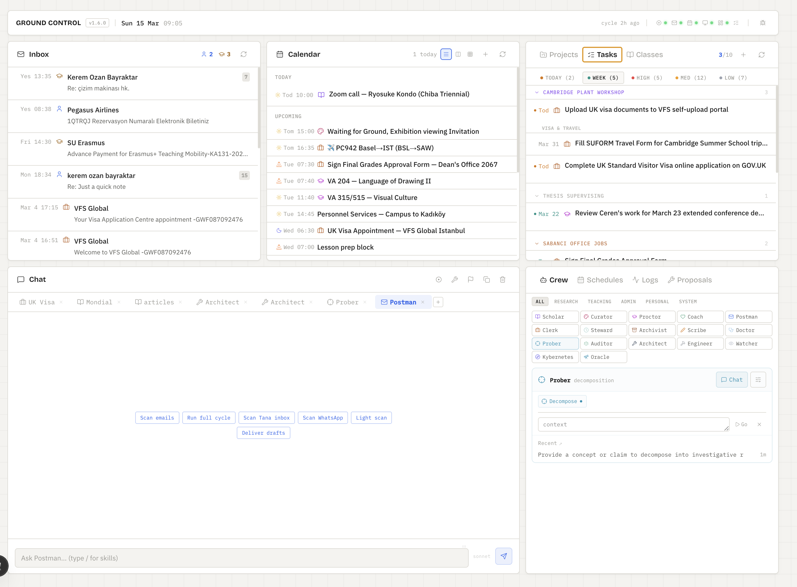
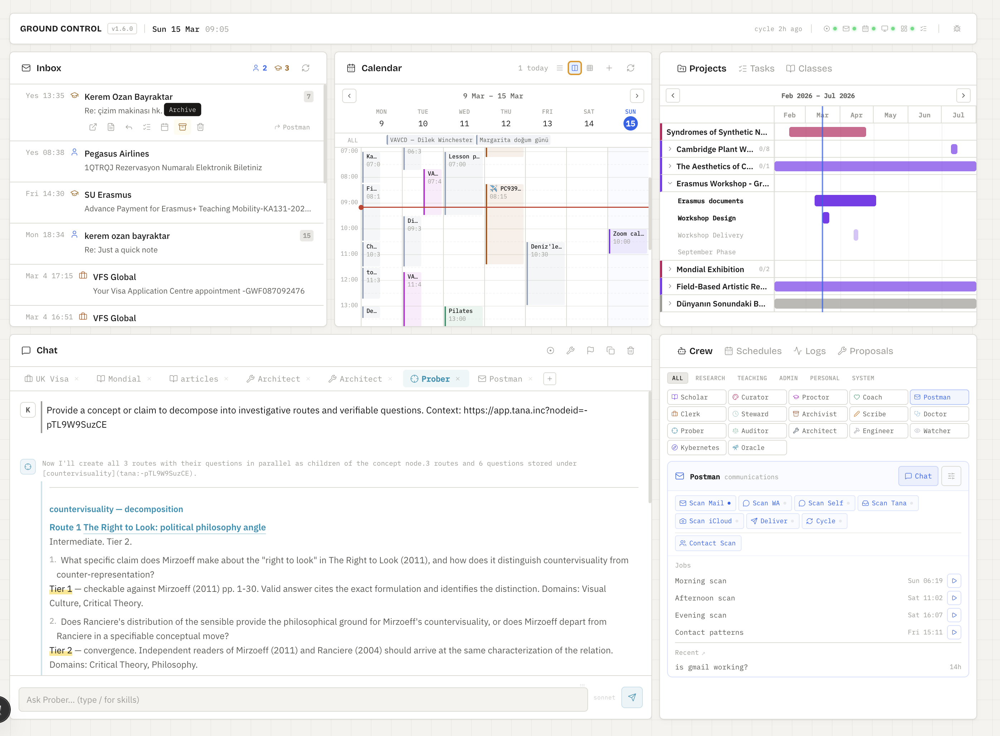

# Ground Control

A multi-agent dashboard that orchestrates AI characters through Claude Code, using Tana as the knowledge and task layer.

I'm not a developer — I built this entirely in Claude Code as a personal system and people asked me to share it. Next.js 15 / React 19 / TypeScript / Tailwind CSS 4.




---

## What is this

Ground Control is a multi-character AI system with a real-time dashboard. You define characters as JSON configs — each with a domain, skills, and personality — and the system routes work to them, spawns Claude Code sessions, and delivers outputs.

The pipeline works like this: **Sources** (Gmail, Tana Inbox) are scanned by **Postman**, who classifies items and routes them to the right **Character**. Characters process their tasks and produce **Outputs** (email drafts, Tana nodes, calendar events). The whole flow is visible in the dashboard.

The system is self-evolving. A nightly watcher reviews logs, identifies recurring errors, updates memory files, and proposes skill edits. A maintenance job checks routing consistency, verifies skill references, and runs type checks. Characters learn from their mistakes and improve over time — without manual intervention.

## Features

**Dashboard**
- 6 widgets: Inbox, Calendar, Tasks, Chat, Crew status, Quick actions
- Real-time SSE streaming for chat with tool activity visibility
- Config-driven color coding for tasks and email classification

**Pipeline**
- Visual flow graph (Sources -> Postman -> Characters -> Outputs)
- Character cards with actions, skills, and spawn controls
- Editable schedule with drag-and-drop timeline

**Characters**
- JSON-driven configs — add a file, dashboard picks it up
- Tiered system: core (domain workers), meta (system maintainers)
- Per-character memory, skills, and routing keywords
- Model escalation (start with Haiku, escalate to Sonnet/Opus)

**Automation**
- Scheduled jobs: email scans, task processing, reviews, maintenance
- Self-learning: auto-extracts communication patterns, schedule preferences
- Cron-style scheduling with full/light scan modes

**Self-evolving**
- Watcher reviews `tiny-log.jsonl` for errors and patterns
- Auto-fixes routing, skills, and memory when patterns repeat
- Maintenance checks memory hygiene, skill references, type safety
- Characters write behavioral lessons to their own memory files

## Requirements

| Requirement | Details |
|---|---|
| **macOS** | Uses launchd for scheduling, mac-specific paths |
| **Node.js 18+** | Next.js runtime |
| **Claude Code CLI** | Character spawning engine — [install guide](https://docs.anthropic.com/en/docs/claude-code/overview) |
| **Claude Plan** | Pro works for chat only. Max 5x or higher recommended for full automation. Alternatively, use an API key. |
| **Tana** | Required — PKM and task layer via [Tana Local MCP](https://tana.inc/articles/get-started-with-tana-s-local-mcp) |
| **Gmail MCP** | Optional — email scanning and draft delivery |
| **Google Calendar MCP** | Optional — calendar integration |

## Quick Start

```bash
git clone https://github.com/YOUR_USERNAME/ground-control.git
cd ground-control
npm install
npm run setup    # interactive wizard
npm run dev      # localhost:3000
```

The setup wizard walks you through:
1. **Identity** — your name (used in character prompts)
2. **Tana** — workspace ID, MCP URL, and token
3. **Gmail** — credential paths (optional)
4. **Calendar** — token path (optional)
5. **Characters** — installs example characters to `~/.claude/characters/`

This generates `ground-control.config.ts` (git-ignored) with your settings. See `ground-control.config.example.ts` for the full schema.

**Or set up with Claude Code:** Since Ground Control is built for Claude Code, you can also just open the project in Claude Code and ask it to help you set up. It can configure your Tana connection, install characters, customize schedules, and get everything running.

## Architecture

```
~/.claude/
  characters/
    core/              # domain workers (postman, scholar, clerk, coach)
    meta/              # system maintainers (architect, oracle)
    stationed/         # project-specific characters
  skills/
    {name}/SKILL.md    # skill definitions
  shared/              # knowledge files (routing table, contacts, etc.)
  logs/tiny-log.jsonl  # action log

ground-control/
  app/
    api/               # 26 API routes
    page.tsx           # dashboard
    pipeline/          # pipeline view
  components/
    home/              # dashboard widgets
    pipeline/          # flow graph, character cards
  lib/                 # core logic (config, spawn, tana, scheduler)
  examples/
    characters/        # template character configs
```

Characters drive everything. The dashboard reads character configs, skills, and knowledge files dynamically through API routes. No character data is hardcoded in the source — add a JSON file and it appears.

## Characters

Each character is a JSON config with:

```json
{
  "name": "Scholar",
  "tier": "core",
  "domain": "research",
  "defaultModel": "sonnet",
  "escalateModel": "opus",
  "skills": ["scholar-research", "scholar-write"],
  "sharedKnowledge": ["identity", "tana-ids"],
  "routingKeywords": ["research", "thesis", "paper"],
  "systemPrompt": "You are Scholar, the research character...",
  "icon": "BookOpen",
  "color": "#7c3aed",
  "actions": [
    { "label": "Research", "icon": "Search", "description": "Deep research on a topic" }
  ],
  "seeds": {
    "Research": "Research this topic for me."
  }
}
```

**Example characters included:**

| Character | Tier | Domain | Role |
|---|---|---|---|
| Postman | core | communications | Scan inputs, classify, route, deliver |
| Scholar | core | research | Research, writing, thesis work |
| Clerk | core | administration | Admin tasks, procedures, forms |
| Coach | core | wellbeing | Personal check-ins, work/life balance |
| Architect | meta | systems | System maintenance, code, self-evolution |
| Oracle | meta | strategy | Strategic advisory, cross-domain analysis |

**Adding a new character:** Drop a JSON file in `~/.claude/characters/core/` (or `meta/`, `stationed/`). The dashboard picks it up automatically — no code changes needed.

## Scheduled Jobs

The config file defines scheduled jobs. Example schedule from `ground-control.config.example.ts`:

| Job | Character | Schedule | Purpose |
|---|---|---|---|
| Morning scan | Postman | 08:00 daily | Full scan of all sources |
| Afternoon scan | Postman | 13:00 daily | Light scan of primary sources |
| Evening scan | Postman | 18:00 daily | End-of-day full scan |
| Evening tasks | System | 19:00 daily | Spawn characters with pending work |
| Nightly watcher | Architect | 22:00 daily | Review logs, fix errors, write lessons |
| System maintenance | Architect | Tue, Fri 14:00 | Memory hygiene, skill verification |
| Weekly review | Coach | Friday 16:00 | Personal wellbeing review |
| Weekly advisory | Oracle | Sunday 20:00 | Strategic cross-domain analysis |
| Contact patterns | Postman | Sunday 21:00 | Learn communication styles from email |
| Calendar intel | Coach | Sunday 20:00 | Learn schedule preferences |

**The self-evolving loop:** Watcher reviews logs nightly -> identifies errors and patterns -> writes memory lessons -> edits skills to prevent recurrence. Maintenance verifies the system stays consistent.

## Configuration

All user-specific settings live in `ground-control.config.ts` (git-ignored, generated by setup wizard).

What's configurable:
- **Identity** — your name
- **Tana** — workspace ID, MCP URL, token
- **Gmail** — account names and credential paths
- **Calendar** — token path
- **Scheduler** — job definitions, task characters, skip patterns
- **Sources / Outputs** — pipeline endpoints shown in the dashboard
- **UI patterns** — track color mapping, email classification colors, label colors

See `ground-control.config.example.ts` for the complete schema with all options.

## MCP Servers

Ground Control connects to external services through MCP (Model Context Protocol) servers. These are configured in `mcp-tasks.json` at the project root for spawned characters.

| Server | Required | What it enables |
|---|---|---|
| [Tana Local MCP](https://tana.inc/articles/get-started-with-tana-s-local-mcp) | Yes | Task management, inbox, knowledge graph |
| [Gmail MCP](https://github.com/anthropics/anthropic-quickstarts/tree/main/gmail-mcp-server) | No | Email scanning, draft creation, delivery |
| [Google Calendar MCP](https://github.com/anthropics/anthropic-quickstarts/tree/main/google-calendar-mcp-server) | No | Calendar events, scheduling |
| [WhatsApp MCP](https://github.com/anthropics/anthropic-quickstarts/tree/main/whatsapp-mcp-server) | No | Messaging integration |
| [Playwright MCP](https://github.com/anthropics/anthropic-quickstarts/tree/main/playwright-mcp-server) | No | Browser automation (form filling, file uploads, web scraping) |

Only Tana is required. Other servers extend functionality but the system works without them.

**Playwright tip:** For persistent browser sessions (no re-authentication on each run), launch Chromium with a fixed profile directory and `--remote-debugging-port=9222`. The dashboard health bar monitors Playwright availability automatically.

## License

[MIT](LICENSE)
